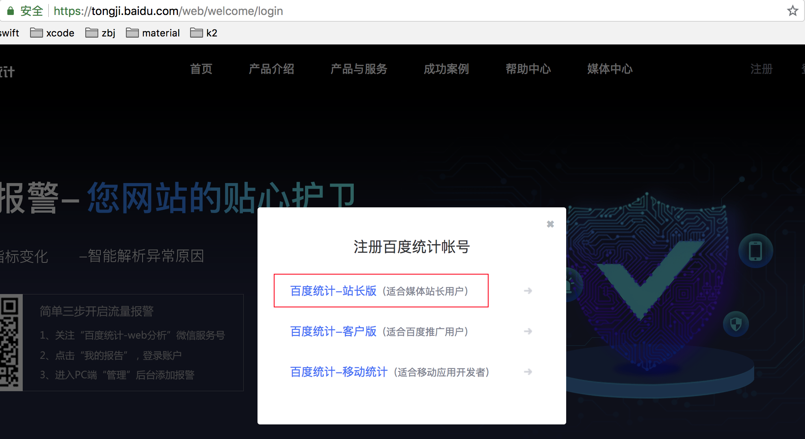

# Why?
有同学问为什么不用 [google analytics](https://analytics.google.com/)

其实是可以用的，因为 `GA` 的统计节点部署在国内，所以访客数据能够正常被发送。

但由于众所周知的种种原因，在墙内无法打开 `Google Analytics` 网站，我们需要翻墙去看报表。

那么百度统计呢？

官网上只有针对网站和 `iOS`、`Android` 应用的的入口，就是找不到统计桌面应用的。

怎么办，我们造一个 ^_^

# How to use?

## 1. 如果还没有百度统计网站账号，请先注册
注册地址: [百度统计](https://tongji.baidu.com/web/welcome/login), 我选择的是 "百度统计-站长版"，其它版本没有测试

## 2. 新增网站
因为我们构建的是 `Electron` 桌面程序，是没有网址的，所以网站域名我们随便填一个，能不能访问都没关系，符合格式就可以了

## 3. 获取 siteId
上面这三步的目的就是一个，拿到 `siteId`

`ps: 图中的代码检测是针对网站的，百度检测不到我们的应用`

## 最后就是安装和使用 electron-baidu-tongji 包了
回到 [Installation](https://github.com/joehecn/electron-baidu-tongji#installation)
